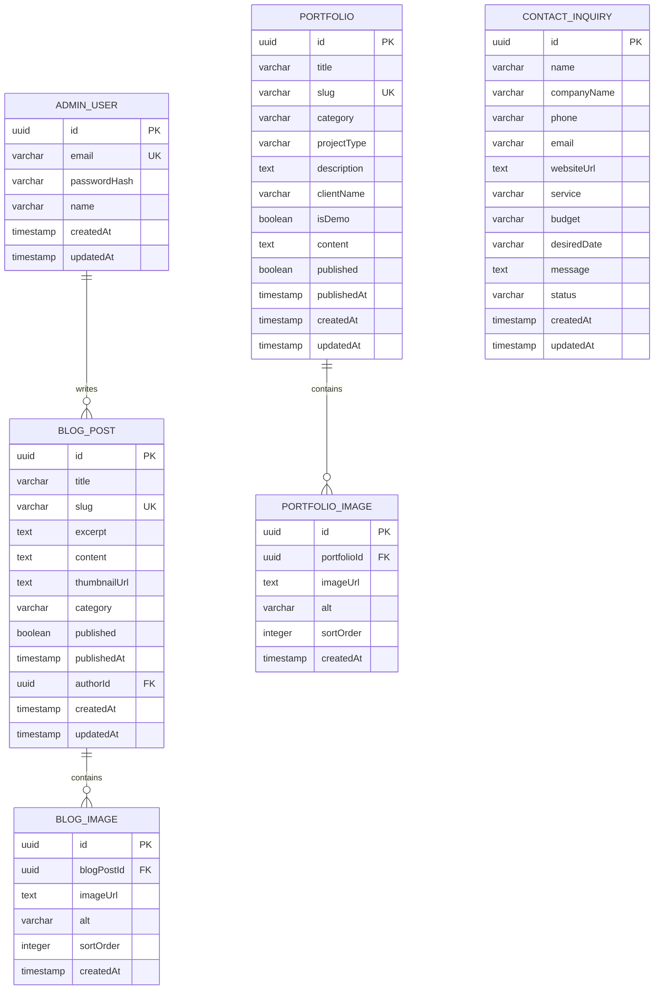

# AJERO 홈페이지 ERD

## 1. ERD 목적

AJERO 웹사이트에서 동적으로 관리해야 하는 데이터를 정의한다.

MVP에서는 다음 데이터를 DB에서 관리한다.

* 관리자
* 포트폴리오
* 포트폴리오 이미지
* 블로그
* 블로그 이미지
* 문의

서비스, 프로세스, About 등의 정적 콘텐츠는 초기에는 DB에 저장하지 않고 코드 또는 콘텐츠 파일로 관리한다.

---

# 2. Entity 목록

## AdminUser

관리자 계정

| Field        | Type      | Constraint       | Description |
| ------------ | --------- | ---------------- | ----------- |
| id           | UUID      | PK               | 관리자 ID      |
| email        | VARCHAR   | UNIQUE, NOT NULL | 로그인 이메일     |
| passwordHash | VARCHAR   | NOT NULL         | 암호화된 비밀번호   |
| name         | VARCHAR   | NOT NULL         | 관리자 이름      |
| createdAt    | TIMESTAMP | NOT NULL         | 생성일         |
| updatedAt    | TIMESTAMP | NOT NULL         | 수정일         |

---

## Portfolio

AJERO가 제작한 프로젝트 및 Demo Project

| Field       | Type      | Constraint       | Description       |
| ----------- | --------- | ---------------- | ----------------- |
| id          | UUID      | PK               | 포트폴리오 ID          |
| title       | VARCHAR   | NOT NULL         | 프로젝트명             |
| slug        | VARCHAR   | UNIQUE, NOT NULL | URL용 slug         |
| category    | VARCHAR   | NOT NULL         | 프로젝트 카테고리         |
| projectType | VARCHAR   | NOT NULL         | 제작 / 리뉴얼 / Demo 등 |
| description | TEXT      | NOT NULL         | 프로젝트 간단 설명        |
| clientName  | VARCHAR   | NULL             | 고객사명, 공개 가능한 경우   |
| isDemo      | BOOLEAN   | NOT NULL         | Demo Project 여부   |
| content     | TEXT      | NOT NULL         | 상세 프로젝트 내용        |
| published   | BOOLEAN   | NOT NULL         | 공개 여부             |
| publishedAt | TIMESTAMP | NULL             | 공개일               |
| createdAt   | TIMESTAMP | NOT NULL         | 생성일               |
| updatedAt   | TIMESTAMP | NOT NULL         | 수정일               |

### category 예시

* CORPORATE
* INTERIOR
* CONSTRUCTION
* SERVICE
* DEMO

### projectType 예시

* NEW
* REDESIGN
* MAINTENANCE
* DEMO

---

# 3. PortfolioImage

포트폴리오에 사용되는 이미지

| Field       | Type      | Constraint   | Description |
| ----------- | --------- | ------------ | ----------- |
| id          | UUID      | PK           | 이미지 ID      |
| portfolioId | UUID      | FK, NOT NULL | 포트폴리오 ID    |
| imageUrl    | TEXT      | NOT NULL     | 이미지 URL     |
| alt         | VARCHAR   | NOT NULL     | 이미지 설명      |
| sortOrder   | INTEGER   | NOT NULL     | 이미지 순서      |
| createdAt   | TIMESTAMP | NOT NULL     | 생성일         |

### Relationship

Portfolio 1 : N PortfolioImage

하나의 포트폴리오는 여러 이미지를 가질 수 있다.

---

# 4. BlogPost

AJERO의 블로그 / 인사이트 콘텐츠

| Field        | Type      | Constraint       | Description |
| ------------ | --------- | ---------------- | ----------- |
| id           | UUID      | PK               | 게시글 ID      |
| title        | VARCHAR   | NOT NULL         | 게시글 제목      |
| slug         | VARCHAR   | UNIQUE, NOT NULL | URL용 slug   |
| excerpt      | TEXT      | NULL             | 요약          |
| content      | TEXT      | NOT NULL         | 본문          |
| thumbnailUrl | TEXT      | NULL             | 썸네일         |
| category     | VARCHAR   | NOT NULL         | 카테고리        |
| published    | BOOLEAN   | NOT NULL         | 공개 여부       |
| publishedAt  | TIMESTAMP | NULL             | 공개일         |
| authorId     | UUID      | FK, NOT NULL     | 작성 관리자      |
| createdAt    | TIMESTAMP | NOT NULL         | 생성일         |
| updatedAt    | TIMESTAMP | NOT NULL         | 수정일         |

### category 예시

* WEBSITE
* SEO
* MARKETING
* INSIGHT
* GUIDE

### Relationship

AdminUser 1 : N BlogPost

관리자 한 명이 여러 게시글을 작성할 수 있다.

---

# 5. BlogImage

블로그 본문에 사용되는 이미지

| Field      | Type      | Constraint   | Description |
| ---------- | --------- | ------------ | ----------- |
| id         | UUID      | PK           | 이미지 ID      |
| blogPostId | UUID      | FK, NOT NULL | 게시글 ID      |
| imageUrl   | TEXT      | NOT NULL     | 이미지 URL     |
| alt        | VARCHAR   | NOT NULL     | 이미지 설명      |
| sortOrder  | INTEGER   | NOT NULL     | 이미지 순서      |
| createdAt  | TIMESTAMP | NOT NULL     | 생성일         |

### Relationship

BlogPost 1 : N BlogImage

---

# 6. ContactInquiry

고객 상담 문의

| Field       | Type      | Constraint | Description |
| ----------- | --------- | ---------- | ----------- |
| id          | UUID      | PK         | 문의 ID       |
| name        | VARCHAR   | NOT NULL   | 문의자 이름      |
| companyName | VARCHAR   | NULL       | 회사명         |
| phone       | VARCHAR   | NOT NULL   | 연락처         |
| email       | VARCHAR   | NOT NULL   | 이메일         |
| websiteUrl  | TEXT      | NULL       | 기존 홈페이지     |
| service     | VARCHAR   | NOT NULL   | 문의 서비스      |
| budget      | VARCHAR   | NULL       | 예상 예산       |
| desiredDate | VARCHAR   | NULL       | 희망 일정       |
| message     | TEXT      | NOT NULL   | 문의 내용       |
| status      | VARCHAR   | NOT NULL   | 문의 상태       |
| createdAt   | TIMESTAMP | NOT NULL   | 문의일         |
| updatedAt   | TIMESTAMP | NOT NULL   | 수정일         |

### service 예시

* WEBSITE
* REDESIGN
* MAINTENANCE
* SEO
* MARKETING
* RESERVATION
* CRM
* AI
* OTHER

### status 예시

* NEW
* IN_PROGRESS
* COMPLETED
* CLOSED

---

# 7. Relationship



---

# 8. 초기 MVP에서 DB에 넣지 않는 데이터

다음 데이터는 초기에는 DB로 관리하지 않는다.

### Service

정적인 서비스 소개이므로 코드에서 관리한다.

* Website
* Maintenance
* SEO
* Content
* Marketing
* AI
* Reservation
* CRM

### Process

* Consultation
* Planning
* Design
* Development
* Launch
* Growth

### About

* AJERO 소개
* 브랜드 철학
* 업무 방식
* 기술 스택

이런 데이터까지 DB로 만들면 초기 프로젝트의 복잡도만 증가한다.

---

# 9. 추후 확장 가능성

서비스가 성장하면 다음 Entity를 추가할 수 있다.

```text
Service
ServiceCategory
FAQ
Testimonial
Client
CaseStudy
Lead
Reservation
Customer
AdminUser
```

특히 문의가 많아지면

```text
ContactInquiry
        ↓
Lead
        ↓
Client
        ↓
Project
```

형태의 CRM 구조로 확장할 수 있다.

---

# 10. MVP 핵심 관계

실제로 개발할 때 가장 중요한 관계는 다음과 같다.

```text
AdminUser
   │
   └── BlogPost
          │
          └── BlogImage

Portfolio
   │
   └── PortfolioImage

ContactInquiry
```

초기 AJERO 홈페이지에서는 이 정도의 ERD로 시작한다.

**핵심 원칙: 처음부터 에이전시용 CRM까지 만들지 말고, 홈페이지 운영에 필요한 데이터만 DB화한다.**
